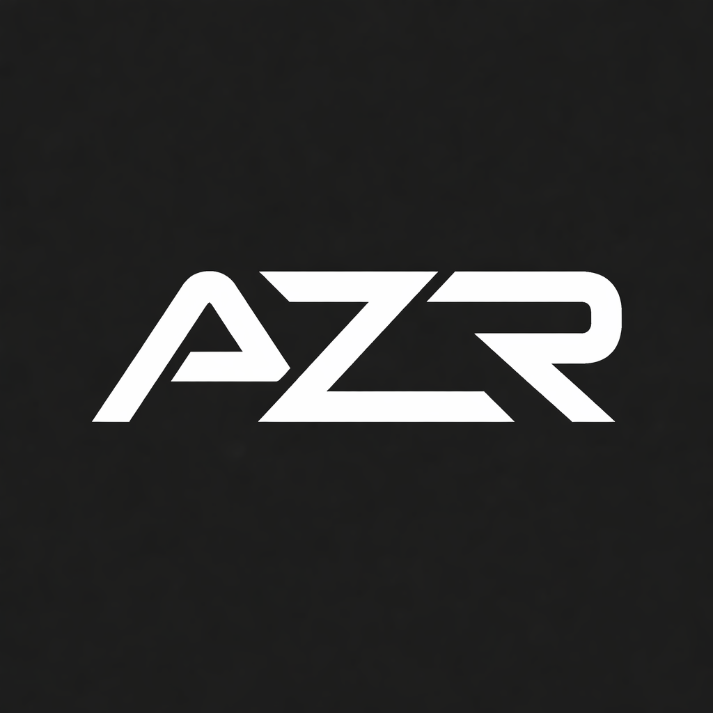

# Devis — Commande en ligne et paiement

**Devis n° :** AZR-D-2026-001  
**Date :** 10 octobre 2026  
**Client :** Poke Bar, Nouméa  
**Prestataire :** AzerSoft  
**Objet :** site, click & collect et paiement carte, deux emplacements

Montants en **francs Pacifique**. Taxe **6 %**.

---

## Ce qui est livré

Deux adresses :

- **pokebar.nc** — le site et la commande en ligne
- **admin.pokebar.nc** — le suivi et la configuration, réservé aux gérants

### Pour le client

- Choix du point de retrait
- Menu et tarifs, avec disponibilité par emplacement
- Composition du poké, dans l’ordre du menu : format (bol, petit bol, wrap), base avec mélange possible, légumes inclus, protéine avec mélange et disponibilité, sauce, suppléments
- Panier
- Créneau de retrait selon les horaires de l’emplacement, **sans limite de places**
- Paiement carte sur la page du prestataire de paiement du client
- Reçu par e-mail et/ou WhatsApp
- Suivi simple : commande reçue, en préparation, prête

### Pour les gérants

- Connexion sur admin.pokebar.nc
- Fiches des deux emplacements (nom, adresse, horaires, ouvert ou fermé)
- Menu, prix, photos, disponibilité
- Commandes du jour, détail du poké, changement de statut
- Historique filtré par emplacement, date et statut
- Statut du paiement tel que renvoyé par le prestataire (payé ou échoué)

### Mise en service

- Site repris dans l’application, avec les deux emplacements et le lien vers la commande
- Hébergement du site et de l’application sur la même machine
- Prise en main d’environ une heure
- Recette du parcours réel, y compris un paiement de test, et correctifs associés

Délai indicatif : **2 à 3 semaines** après l’acompte, la fourniture du menu et l’accès au compte de paiement.

---

## Forfait

|                                            | HT          | Taxe 6 % | TTC         |
| ------------------------------------------ | ----------- | -------- | ----------- |
| Conception, réalisation et mise en service | 420 000 XPF | 25 200   | **445 200** |

### Règlement

| Étape                                                         | Part | HT      | TTC     |
| ------------------------------------------------------------- | ---- | ------- | ------- |
| À la commande                                                 | 20 % | 84 000 | 89 040 |
| Démonstration du parcours de paiement (environnement de test) | 30 % | 126 000 | 133 560 |
| Mise en ligne                                                 | 50 % | 210 000 | 222 600 |

---

## Option — limite de commandes par créneau

Non incluse dans le forfait ci-dessus.

Un nombre maximum de commandes par créneau et par emplacement. Un créneau complet n’est plus proposé. La place est retenue pendant le paiement et libérée si le paiement échoue. Le tableau de bord affiche le remplissage et permet de fermer un créneau.

|                           | HT               | TTC         |
| ------------------------- | ---------------- | ----------- |
| Supplément                | **+ 50 000 XPF** |             |
| Forfait avec cette option | 470 000 XPF      | **498 200** |

Règlement dans ce cas, TTC : 99 640 (20 %), 149 460 (30 %), 249 100 (50 %).

---

## Après la mise en ligne

|                                  | HT                   | TTC              |
| -------------------------------- | -------------------- | ---------------- |
| Hébergement (site + application) | 2 400 XPF / mois     |                  |
| Redirection du nom de domaine    | 300 XPF / mois       |                  |
| **Total mensuel**                | **2 700 XPF / mois** | **2 862 / mois** |

L’hébergement du site vitrine n’est pas facturé à part : il est sur la même machine que l’application.

### Option — maintenance annuelle

|                | HT                   | TTC              |
| -------------- | -------------------- | ---------------- |
| Forfait annuel | **100 000 XPF / an** | **106 000 / an** |

Correctifs, petites évolutions et assistance sur le site et l’application.

Sans cette option, les interventions se devisent à part.

---

## Année 1, à titre indicatif

Hors commissions du prestataire de paiement.

|                                              | HT          | TTC     |
| -------------------------------------------- | ----------- | ------- |
| Forfait + 12 mois                            | 452 400 XPF | 479 544 |
| Avec la maintenance annuelle                 | 552 400 XPF | 585 544 |
| Avec la limite par créneau, sans maintenance | 502 400 XPF | 532 544 |
| Avec la limite par créneau et la maintenance | 602 400 XPF | 638 544 |

---

## Non compris

- Commissions du prestataire de paiement
- SMS
- Livraison
- Promotions, fidélité, tableaux de bord avancés
- Application mobile native
- Remboursements (ils se font dans l’interface du prestataire de paiement)
- Évolutions majeures après la mise en ligne

## Fourni par le client

- Textes, prix et photos du menu
- Horaires des deux emplacements
- Compte de paiement ouvert et accessible pour les tests, puis pour la mise en ligne

---

Devis n° AZR-D-2026-001, établi le 10 octobre 2026. Valable 30 jours. Taxe 6 %.

**AzerSoft SARL**  
Raison sociale : AzerSoft SARL  
RIDET : 1 475 672.001  
Capital : 100 000 XPF  
Siège : 8, rue de l'Îlot Noumba

---

## Annexe — détail du chiffrage

Tarif : **40 000 XPF HT** par jour, sauf les deux forfaits indiqués. Montants hors taxes.

| Poste                                                                                           | Jours   | Montant HT  |
| ----------------------------------------------------------------------------------------------- | ------- | ----------- |
| Cadrage (déplacements, rendez-vous, règles des deux emplacements)                               | forfait | 25 000      |
| Mise en place : environnement, déploiement, redirection DNS                                    | forfait | 15 000      |
| Système d’authentification sécurisé                                                             | 0,5     | 20 000      |
| Fiches Les Quais Ferry et Ouen Toro                                                             | 0,25    | 10 000      |
| Menu, prix, photos, disponibilité par emplacement                                               | 1       | 40 000      |
| Composition du poké (format, base et mélange, légumes, protéine et mélange, sauce, suppléments) | 1       | 40 000      |
| Écran de commande côté client                                                                   | 1       | 40 000      |
| Panier                                                                                          | 0,5     | 20 000      |
| Créneaux de retrait, sans limite de places                                                      | 0,25    | 10 000      |
| Paiement carte (page du prestataire, configuration)                                             | 1,5     | 60 000      |
| Confirmation de paiement, reçu e-mail et/ou WhatsApp                                            | 0,5     | 20 000      |
| Tableau de bord des commandes du jour                                                           | 1       | 40 000      |
| Historique et statut de paiement                                                                | 0,25    | 10 000      |
| Statuts : reçue, en préparation, prête                                                          | 0,25    | 10 000      |
| Site repris dans l’application, deux emplacements, lien commande                                | 0,25    | 10 000      |
| Recette du parcours réel, correctifs, prise en main                                             | 1,25    | 50 000      |
| **Total HT**                                                                                    |         | **420 000** |
| Taxe 6 %                                                                                        |         | 25 200      |
| **Total TTC**                                                                                   |         | **445 200** |

### Option — limite par créneau

| Poste                                                | Montant HT  |
| ---------------------------------------------------- | ----------- |
| Créneaux avec un plafond (1 jour au lieu de 0,25)    | 40 000      |
| Tableau de bord : compteur et fermeture d’un créneau | 20 000      |
| Moins le créneau sans plafond déjà inclus            | −10 000     |
| **Supplément HT**                                    | **50 000**  |
| **Total HT avec l’option**                           | **470 000** |
| Taxe 6 %                                             | 28 200      |
| **Total TTC avec l’option**                          | **498 200** |